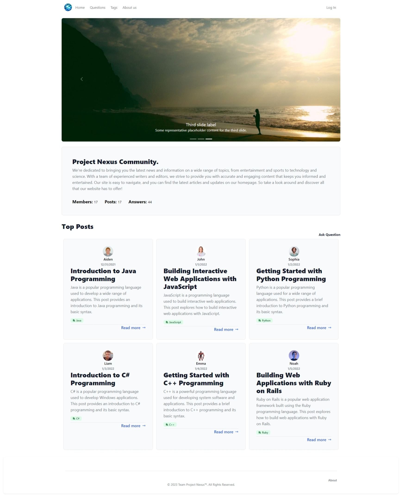
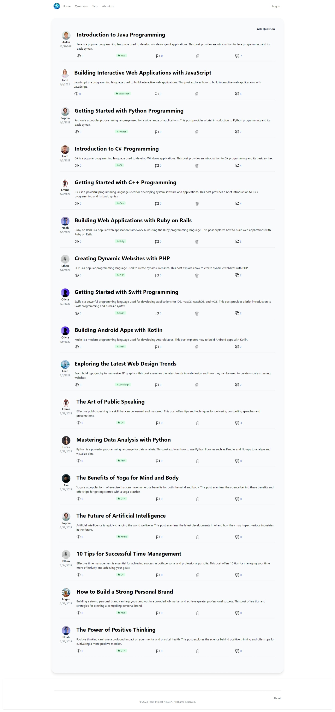
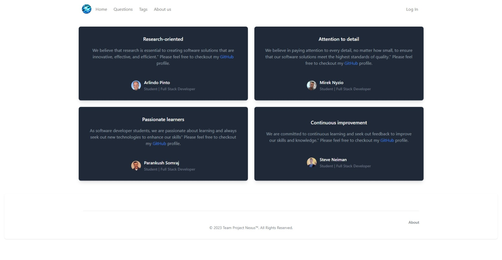

# Project-Nexus
A website that caters to developers of all levels, providing them with a platform to connect, collaborate, and learn from each other.
Project Nexus is a web-based application similar to Stack Overflow that allows users to ask questions, provide answers, and engage in discussions related to programming and software development. The website has a user registration and login system, a user profile page, a page for asking and answering questions, functionality, and a voting system to allow users to upvote or downvote questions and answers.

# Link to Project-Nexus:
https://project-nexus.herokuapp.com/

# Screen Prints:

# Team Members:

- Arlindo Pinto
- Mirek Nyzio
- Parankush Somraj
- Tzvi Neiman

# Technologies Used:

- MySQL
- Sequelize
- Handlebars
- Tailwind CSS
- Heroku
- Insomnia

# About Us
